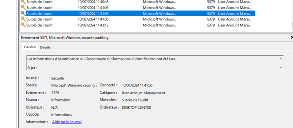
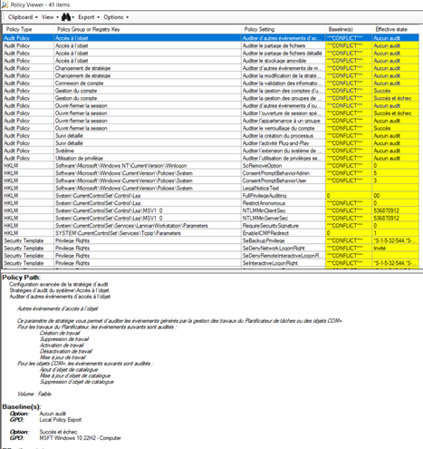
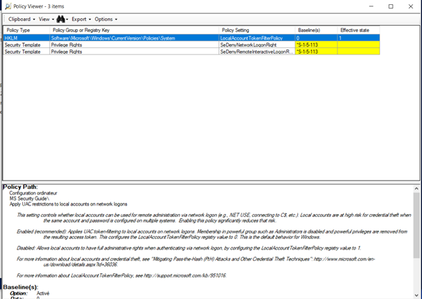
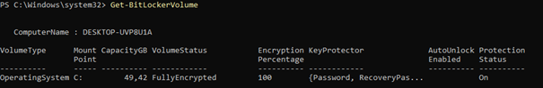
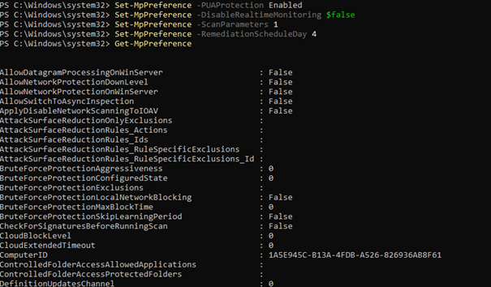

#	Config Auditpol

    

 
	# Comparatifs PolicyAnalyzer avant et après le durcissement.
## Avant :
 

    

## Après :
 

    

#	Résultat de la commande Get-BitLockerVolume
 

    

## Résultat de la commande Get-MpPreference

    

 

La configuration Auditpol initiale n’est pas persistante car les GPO sont prioritaires...
